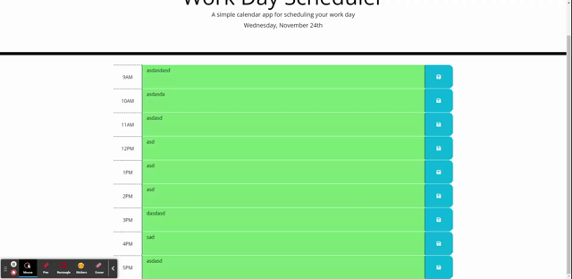

# 05 Third-Party APIs: Work Day Scheduler

# Summary
*This application is a simple calander that allows the user to save events for each hour of the day and As an employee with a busy schedule we want to add important events to a daily planner, So that we can manage my time effectively*. 

# Screenshot

# Git Hub:

*My project was pushed to GitHub at the following repository*:https://github.com/syke2good/DayPlanner

*You can access the deployed application with the GitHup Pages link*:https://syke2good.github.io/DayPlanner/

# WEB API's: 
- jQuery - Used for event listeners of parent and childeren elements as well as to store and recall those varible in local storage.
- momentjs - Used to pull current date and local time.
- javascript - Used to dynamically change html and store user-input.
- Bootstrap - Used to pull existing html and CSS for creating resposive organizational structer and styling for the site.
- HTML - Used to create elements on the DOM
- CSS - Styles html elements on page
- Git - Version control system to track changes to source code
- GitHub - Hosts repository that can be deployed to GitHub Pages

# Sources: 
- jQuery
- HTML
- CSS
- Boostrap

# License Copyright (c) 2012-2021 Scott Chacon and others

*Permission is hereby granted, free of charge, to any person obtaining a copy of this software and associated documentation files (the "Software"), to deal in the Software without restriction, including without limitation the rights to use, copy, modify, merge, publish, distribute, sublicense, and/or sell copies of the Software, and to permit persons to whom the Software is furnished to do so, subject to the following conditions:*

*The above copyright notice and this permission notice shall be included in all copies or substantial portions of the Software.*

*THE SOFTWARE IS PROVIDED "AS IS", WITHOUT WARRANTY OF ANY KIND, EXPRESS OR IMPLIED, INCLUDING BUT NOT LIMITED TO THE WARRANTIES OF MERCHANTABILITY, FITNESS FOR A PARTICULAR PURPOSE AND NONINFRINGEMENT. IN NO EVENT SHALL THE AUTHORS OR COPYRIGHT HOLDERS BE LIABLE FOR ANY CLAIM, DAMAGES OR OTHER LIABILITY, WHETHER IN AN ACTION OF CONTRACT, TORT OR OTHERWISE, ARISING FROM, OUT OF OR IN CONNECTION WITH THE SOFTWARE OR THE USE OR OTHER DEALINGS IN THE SOFTWARE.*